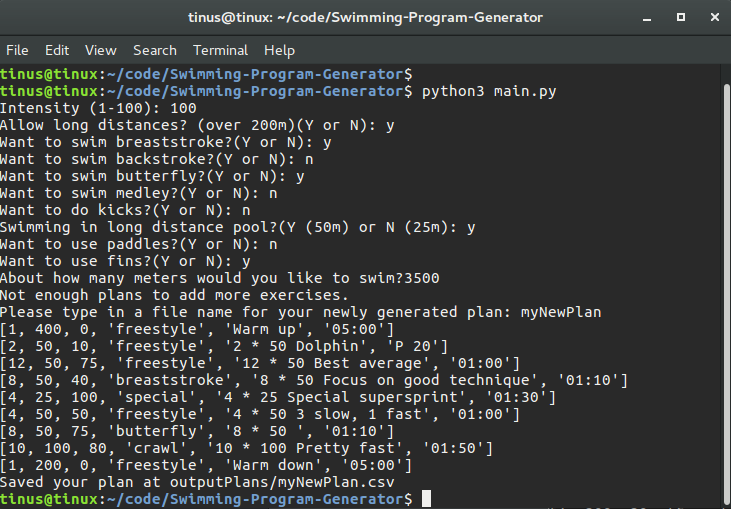
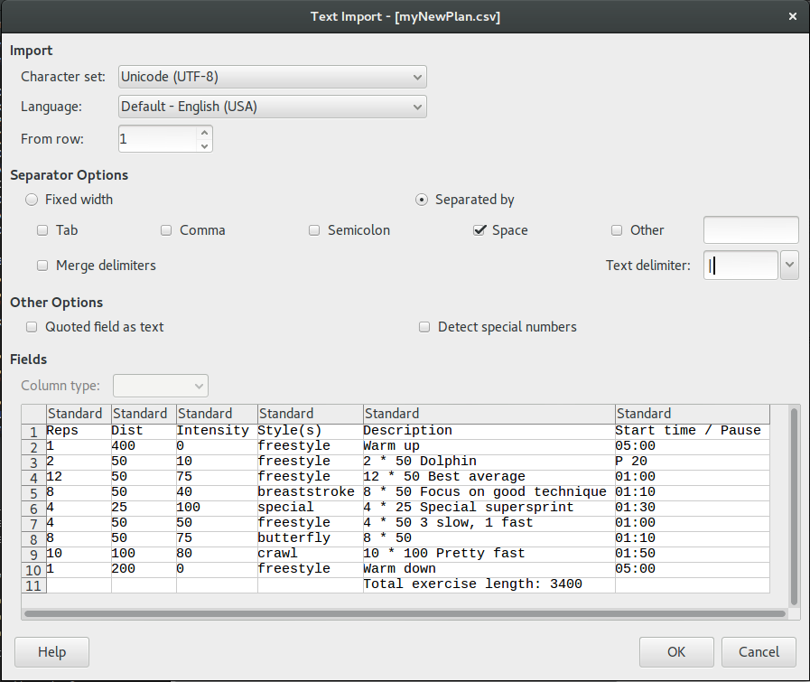
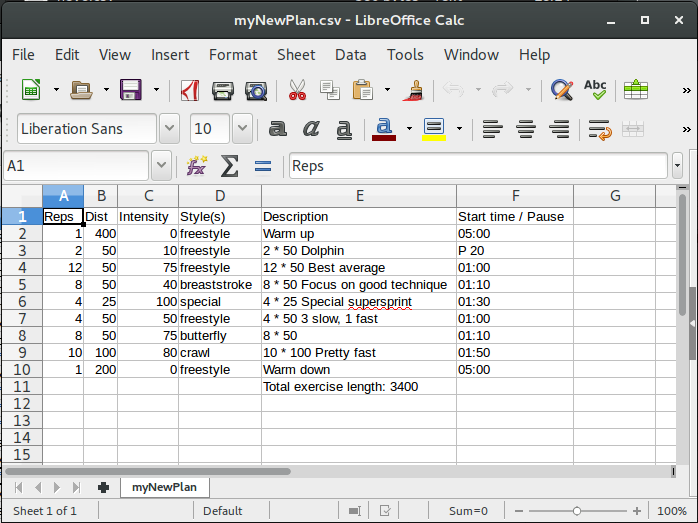

# Swimming-Program-Generator  
Automatic swimming program generator based on desired input parameter.  

# How to use it:
* Run main.py using python 3.*

* Answer all the questions
* Type in a file name for the new plan you have created.

* Open the newly created file in Excel/ LibreOffice Calc or something similar.
* Choose the correct seperating option (space) and the correct delimiter option (|)

# TODO & plan
* Stop using camelCase?
* ~~Toggles for 50/25m pool, all kinds of equipment.~~
* ~~Toggles for different strokes you want to include.~~
* ~~Ask how hard exercise you want.~~
* ~~Intensity from 1 to 100~~
* ~~Output to a spreadsheet?~~
* ~~All kinds of exercises stored in .csv file maybe?~~
* ~~Save and load settings.~~
* ~~Add some easy 100 meter freestyles after some more intense exercises.~~
* ~~Do something with intensity~~
* ~~toggle for allowing long distances (over 200)~~
